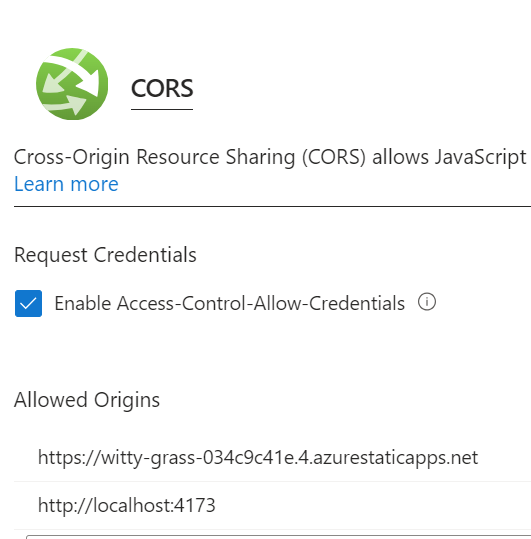

# Table of contents

- [Table of contents](#table-of-contents)
- [Configure CORS](#configure-cors)
  - [Configure CORS via backend code](#configure-cors-via-backend-code)
  - [Configure CORS via Azure portal](#configure-cors-via-azure-portal)
- [Current CORS configuration](#current-cors-configuration)
- [Appendix](#appendix)
  - [CORS reference](#cors-reference)

# Configure CORS

The API backend at [`./src/api`] must have appropriately configured [CORS], so that web app frontend can call it,
be it from Azure, or localhost deployment.

## Configure CORS via backend code

Per [Enable Cross-Origin Requests (CORS) in ASP.NET Core],
specifically [Test CORS][Enable Cross-Origin Requests (CORS) in ASP.NET Core / Test CORS],
and [Add CORS functionality to REST API], you can add CORS policy via code.

For a confirmed example of this code setup working, see [commit c1b096f: add API CORS policy in code].

## Configure CORS via Azure portal

You can configure CORS on Azure portal, e.g. at [`game-api1` CORS page]. See [SO: CORS in Azure app service].

For an example working config, see [#cors-reference](#cors-reference).

The Azure portal configuration takes precedence over code. From [SO: CORS in Azure app service]:

> If you set CORS policy in both Code and in Azure Portal, then the setting of code
> will be overridden with the settings in Portal.

> [!NOTE]
> Azure Portal CORS page has some limitations, e.g. about wildcards, as explained in
> [this FAQ](https://learn.microsoft.com/en-us/azure/app-service/app-service-web-tutorial-rest-api#how-do-i-set-allowed-origins-to-a-wildcard-subdomain).

> [!TIP]
> Configuring CORS via Azure portal is especially useful for quick one-off tests, e.g. by calling the API from localhost
> vite preview.

# Current CORS configuration

As of 12/15/2023:

The Azure API backend [`game-api1`] has in [its CORS page][`game-api1` CORS page] configured two values:

- `https://witty-grass-034c9c41e.4.azurestaticapps.net` to allow the web app frontend to call it
- `http://localhost:4173`, to allow the localhost vite preview to call it.

In addition, the [commit e7c81ea: configure localhost CORS] configures in code the API backend app to allow
`http://localhost:5173` to call the API when the API is also deployed on localhost.

# Appendix

## CORS reference

- [Enable Cross-Origin Requests (CORS) in ASP.NET Core]
- [Add CORS functionality to REST API]
- [SO: CORS in Azure app service]
- [General SO post about CORS errors](https://stackoverflow.com/questions/43871637/no-access-control-allow-origin-header-is-present-on-the-requested-resource-whe)
- [CORS on Wikipedia](https://en.wikipedia.org/wiki/Cross-origin_resource_sharing)
- [CORS on Mozilla Developer Network][CORS]
- [W3C CORS protocol spec](https://fetch.spec.whatwg.org/#http-cors-protocol)
- [ChatGPT conversation about CORS and `curl`](https://chat.openai.com/share/db060e16-3110-4ddb-b370-32682425907b)
- [SO explanation why CORS works for `curl`](https://stackoverflow.com/questions/38689350/for-what-reason-i-can-access-the-resources-by-curl-but-not-in-the-browser)
  - `curl` CORS handling is also mentioned
    [in Microsoft docs in "Test CORS"][Enable Cross-Origin Requests (CORS) in ASP.NET Core / Test CORS].
- Vite uses [npm cors package](https://www.npmjs.com/package/cors) per [this reference](https://github.com/vitejs/vite/blob/19e3c9a8a16847486fbad8a8cd48fc771b1538bb/packages/vite/package.json#L103).
  - I think this would be relevant only if the vite-powered server would receive calls, i.e. serve as API backend.
    This is corroborated by [this SO answer](https://stackoverflow.com/a/71755066/986533).
  - Additional [Vite CORS TSG](https://vitejs.dev/guide/troubleshooting#build).
- [CORS in localhost Chrome](https://stackoverflow.com/questions/10883211/why-does-my-http-localhost-cors-origin-not-work)

Example config for [`game-api1` CORS page]:

<!--
## references
-->

[`./src/api`]: ../src/api
[`game-api1`]: https://portal.azure.com/#@spawarottijamro.onmicrosoft.com/resource/subscriptions/8695c84c-09a4-4b50-994f-a2fa7f36cc92/resourcegroups/game-rg/providers/Microsoft.Web/sites/game-api1/appServices
[`game-api1` CORS page]: https://portal.azure.com/#@spawarottijamro.onmicrosoft.com/resource/subscriptions/8695c84c-09a4-4b50-994f-a2fa7f36cc92/resourcegroups/game-rg/providers/Microsoft.Web/sites/game-api1/apiCors
[Add CORS functionality to REST API]: https://learn.microsoft.com/en-us/azure/app-service/app-service-web-tutorial-rest-api#add-cors-functionality
[commit c1b096f: add API CORS policy in code]: https://github.com/konrad-jamrozik/game/commit/c1b096f69a96718eff6041ccf616ca9923777eed
[commit e7c81ea: configure localhost CORS]: https://github.com/konrad-jamrozik/game/commit/e7c81ea32bfed773509eea33bcff6b0c710a2b54
[CORS]: https://developer.mozilla.org/en-US/docs/Web/HTTP/CORS
[Enable Cross-Origin Requests (CORS) in ASP.NET Core]: https://learn.microsoft.com/en-us/aspnet/core/security/cors?view=aspnetcore-8.0
[Enable Cross-Origin Requests (CORS) in ASP.NET Core / Test CORS]: https://learn.microsoft.com/en-us/aspnet/core/security/cors?view=aspnetcore-8.0#test-cors
[SO: CORS in Azure app service]: https://stackoverflow.com/questions/75702313/how-to-configure-cors-on-azure-app-service
